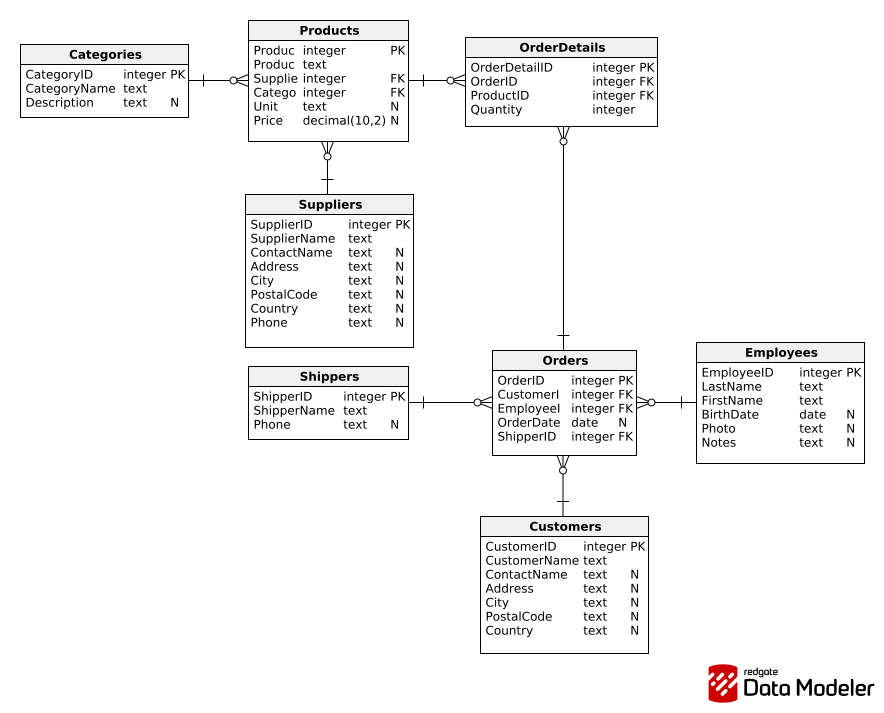
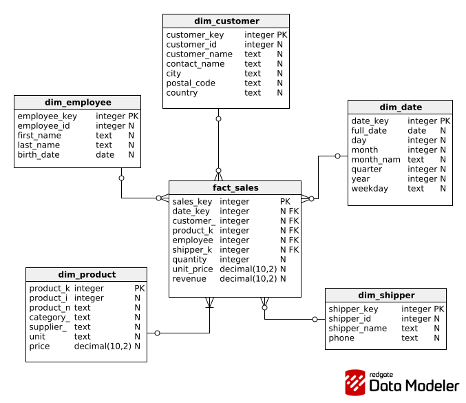

# Pipeline ETL de Vendas (Bronze → Silver → Gold)

Projeto de engenharia de dados com arquitetura medallion para ingestao, tratamento e modelagem analitica de dados de vendas.

## Objetivo

Construir um pipeline ETL completo que:

1. Ingere dados transacionais de um PostgreSQL de origem.
2. Aplica validacoes e padronizacoes na camada Silver.
3. Converte o modelo transacional para modelo dimensional na camada Gold.
4. Persiste a camada Gold em CSV e em PostgreSQL de destino.

## Decisao de arquitetura (S3 x PostgreSQL)

Em um cenario de producao, a publicacao das camadas curadas e analiticas poderia ser feita em S3/Data Lake.
Para simplificar este projeto, foi adotado PostgreSQL para toda a jornada de persistencia final (alem dos CSVs locais de cada camada).

## Tecnologias utilizadas

- Python 3.12
- Pandas
- SQLAlchemy
- Psycopg2
- Python-Dotenv
- Arquitetura Medallion (Bronze, Silver, Gold)
- POO e principios SOLID

Dependencias instaladas no projeto estao em `requirements.txt`.

## Estrutura do projeto

```text
.
├── app.py
├── requirements.txt
├── data/
│   ├── bronze/
│   ├── silver/
│   └── gold/
└── src/
    ├── db/                 # provider de conexao e engine compartilhada
    ├── extract/            # extracao de origem para bronze
    ├── transform/          # validacoes e transformacoes da silver
    ├── pipeline/           # orquestracao bronze->silver e silver->gold
    ├── modeling/           # modelagem dimensional (dims + fato)
    ├── load/               # persistencia (csv, postgres, quarentena)
    └── utils/              # utilitarios de ambiente
```

## Modelagem de dados

### 1. Modelagem transacional (OLTP)

Modelo normalizado de origem, com tabelas de negocio e relacionamentos transacionais.



Arquivo SQL de referencia:

- `data/bronze/sql-transacional-database.sql`

### 2. Modelagem dimensional (OLAP)

Modelo em estrela para analise, composto por dimensoes e fato de vendas.



Arquivo SQL de referencia:

- `data/gold/sql_modelagem_dimensional.sql`

### Mapeamento transacional -> dimensional

| Transacional                            | Dimensional    |
| --------------------------------------- | -------------- |
| `Customers`                             | `dim_customer` |
| `Products` + `Categories` + `Suppliers` | `dim_product`  |
| `Employees`                             | `dim_employee` |
| `Shippers`                              | `dim_shipper`  |
| `Orders` (datas)                        | `dim_date`     |
| `Orders` + `OrderDetails` + `Products`  | `fact_sales`   |

## Fluxo de funcionamento do pipeline

O pipeline possui duas etapas principais de orquestracao:

1. `PipelineRunner`: bronze -> silver
2. `GoldPipelineRunner`: silver -> gold

### Etapa 1: Ingestao (PostgreSQL origem -> Bronze)

- `PostgresTableCsvExporter` consulta as tabelas do schema configurado no banco de origem.
- Cada tabela e exportada para `data/bronze/*.csv`.

### Etapa 2: Transformacao (Bronze -> Silver)

- Leitura dos CSVs da Bronze.
- Aplicacao dos transformers por entidade (`categories`, `customers`, `employees`, `orders`, etc.).
- Validacao de integridade referencial (FKs) entre dataframes transformados.
- Registros invalidos sao enviados para quarentena (`data/quarantine/`) com motivo e timestamp.
- Registros validos sao persistidos em `data/silver/`.

### Etapa 3: Carga analitica (Silver -> Gold)

- `DimensionalModelingService` gera:
  - `dim_customer`
  - `dim_product`
  - `dim_employee`
  - `dim_shipper`
  - `dim_date`
  - `fact_sales`
- Validacoes de qualidade da Gold:
  - unicidade de surrogate keys
  - nulls em FKs
  - regras de medida (`quantity > 0`, `unit_price >= 0`, `revenue >= 0`)
- Persistencia final em:
  - CSVs (`data/gold/*.csv`)
  - PostgreSQL de destino (database target)

## Como executar o projeto

### Pre-requisitos

- Python 3.12+
- PostgreSQL com:
  - banco de origem (transacional)
  - banco de destino (dimensional)

### 1. Criar e ativar ambiente virtual

No Windows (PowerShell):

```powershell
python -m venv .venv
.\.venv\Scripts\Activate.ps1
```

### 2. Instalar dependencias

```powershell
pip install -r requirements.txt
```

### 3. Configurar variaveis de ambiente

Crie/ajuste o arquivo `.env` na raiz do projeto:

```env
DATABASE_HOST=localhost
DATABASE_PORT=5432
DATABASE_USER=postgres
DATABASE_PASSWORD=sua_senha
DATABASE_SCHEMA=public
DATABASE_DB_SOURCE=banco
DATABASE_DB_TARGET=banco2
```

### 4. Executar pipeline completo

```powershell
python app.py
```

### 5. Resultados esperados

Ao final da execucao:

- Bronze preenchida em `data/bronze/`
- Silver preenchida em `data/silver/`
- Gold preenchida em `data/gold/`
- Tabelas da Gold gravadas no PostgreSQL de destino (`DATABASE_DB_TARGET`)

## Tabelas geradas na Gold

- `dim_customer`
- `dim_product`
- `dim_employee`
- `dim_shipper`
- `dim_date`
- `fact_sales`

## Observabilidade e qualidade de dados

- Logging em todas as etapas de extracao, transformacao e carga.
- Quarentena para registros invalidos com motivo e timestamp.
- Validacoes de integridade referencial e regras de negocio antes da carga final.
